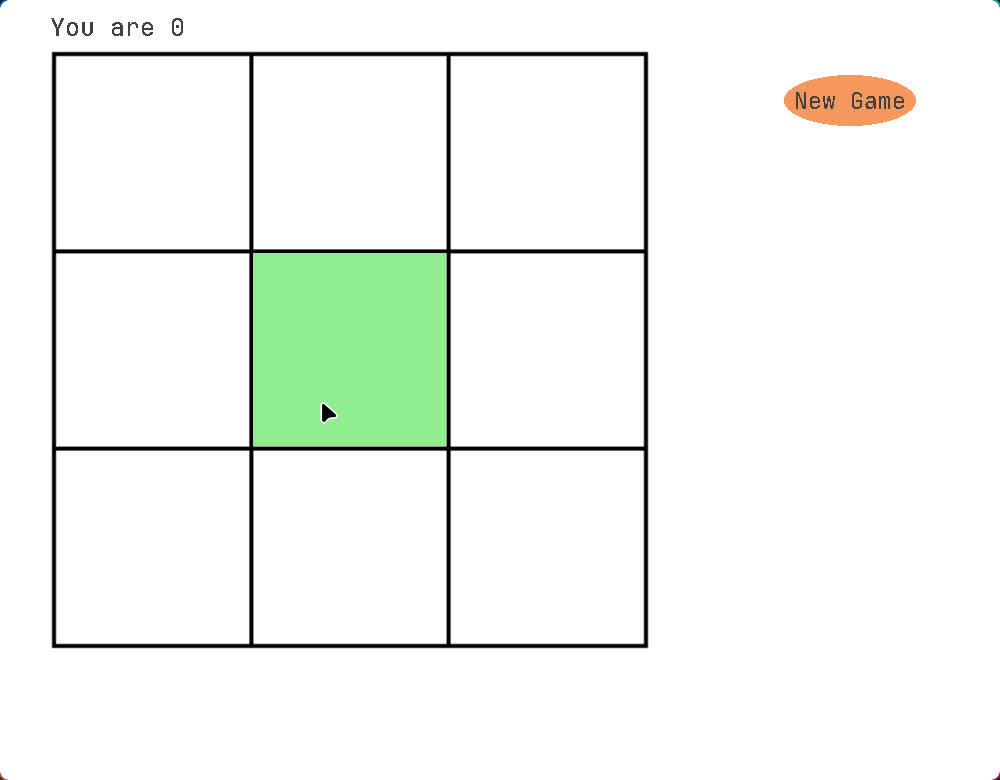
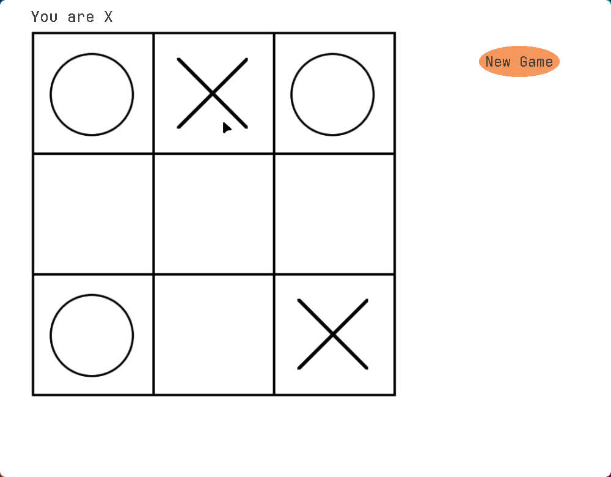
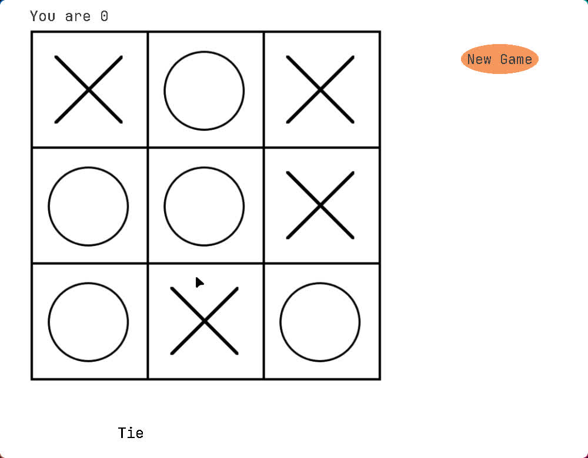
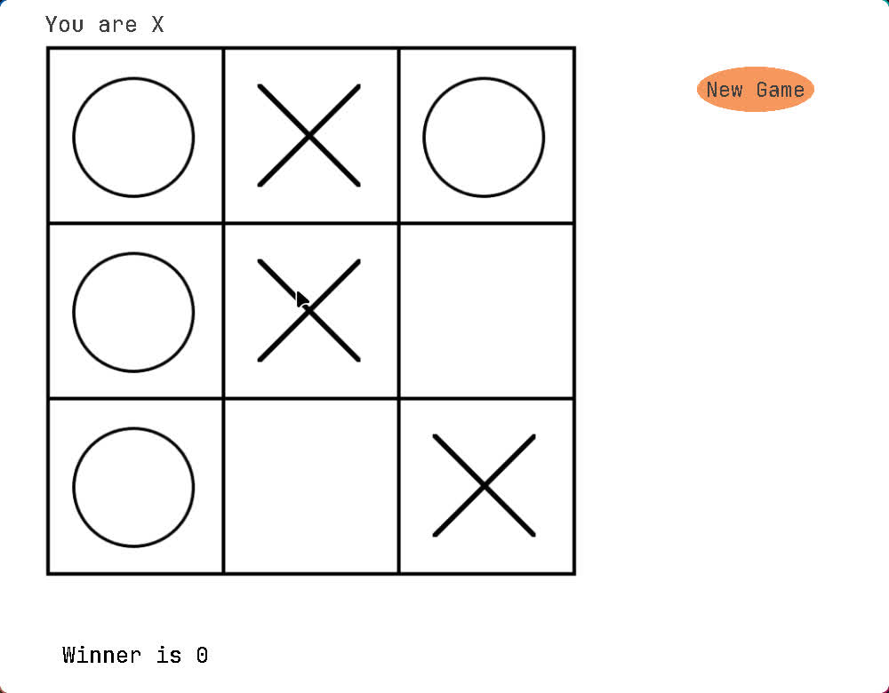

### Tictactoe
Tictactoe game.  
Dependency:
```
Python 3.12.4
Pip 24.2
Pygame 2.6.1
c++ 17 (201703L)
```

#### Requirement
It requires pygame and bot.so from minimaxbot.cpp.
```bash
pip install -r requirement.txt
```

#### Build
Directly:
```bash
c++ minimaxbot.cpp -o bot.so -shared -fPIC
```
Makefile:
```bash
make build
```

#### Run
Directly:
```bash
python Main.py
```
Makefile:
```bash
make run
```
All the inputs are mouse based with only left click available.

##### Screenshots




